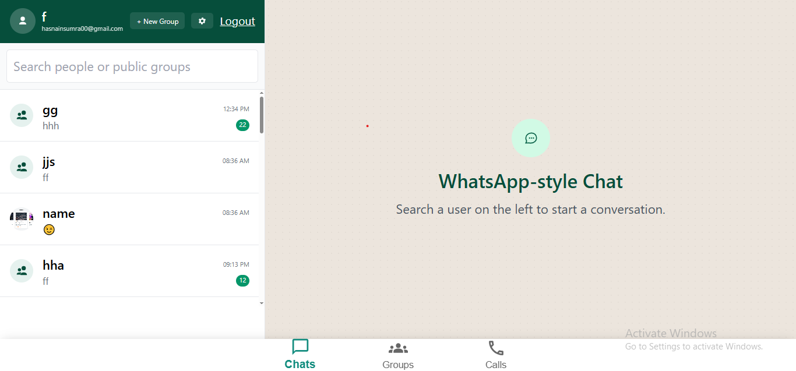
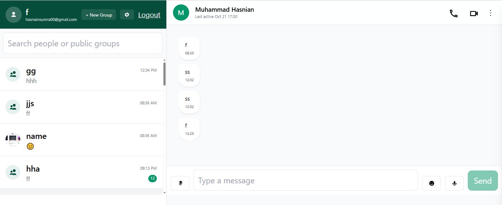
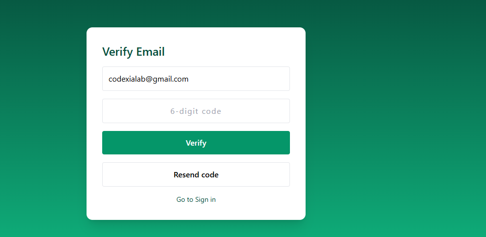
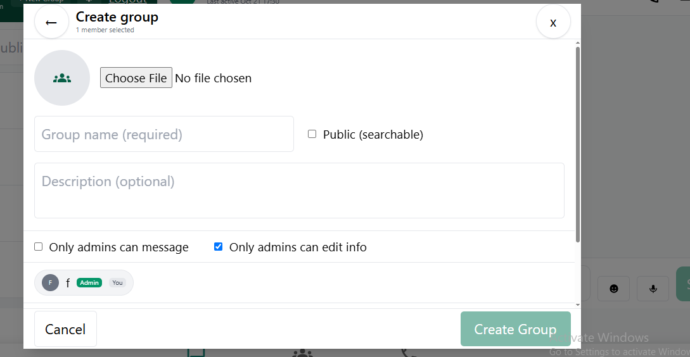
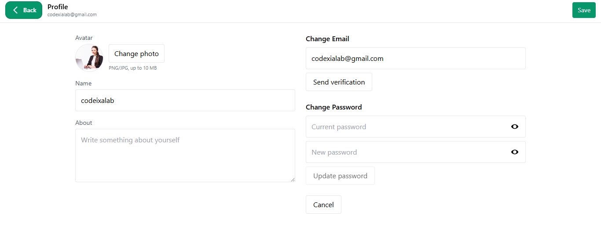
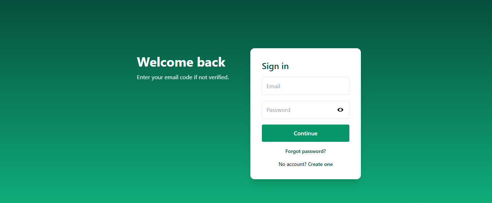
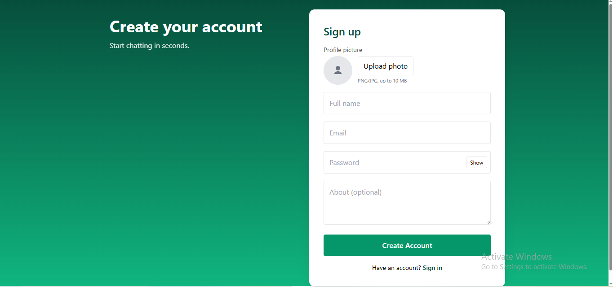
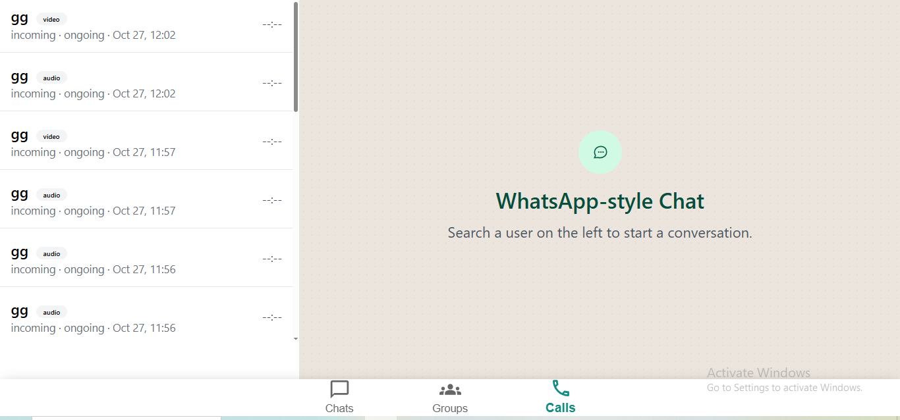

````md
# 💬 WhatsApp-style Chat (MERN)

A production-ready real-time chat app: **email signup + verification**, 1-to-1 and **group chats** (active members & presence), **search & discover groups**, user profiles, **emoji**, **reply**, **copy**, **file/image/video (up to GBs)**, **voice notes**, and **audio/video calls** — all with a clean, modern UI.

---

## 🚀 Tech Stack

| Layer      | Technologies |
|-----------|--------------|
| Frontend  | React 18, Vite, React Router, MUI, Tailwind, Zustand, Socket.IO client |
| Backend   | Node.js, Express, Mongoose (MongoDB), JWT, Nodemailer, Multer, Socket.IO |
| Dev Tools | Nodemon, Day.js, Morgan |

---

## 📂 Project Structure

```text
chat/
├─ client/                     # React + Vite app
│  ├─ public/
│  │  └─ screenshots/         # README images live here
│  └─ src/                    # pages, components, store, api
└─ server/                     # Express API + Socket.IO
   └─ src/                    # routes, models, sockets, config
````

---

## ⚙️ Run Locally

### 1) Backend

```bash
cd server
cp .env.example .env
npm install
npm run dev
# API → http://localhost:5000  (change if your .env uses another PORT)
```

**server/.env (example)**

```ini
PORT=5000
MONGO_URI=mongodb://localhost:27017/whatsapp
JWT_SECRET=replace-with-strong-secret

# Comma-separated origins for CORS/Socket.IO (dev):
CORS_ORIGIN=http://localhost:5173

# SMTP (for email verification)
SMTP_HOST=smtp.gmail.com
SMTP_PORT=587
SMTP_USER=your@gmail.com
SMTP_PASS=app-password
FROM_EMAIL="Chat App <your@gmail.com>"
```

> Backend HTTPS ke liye `server/certs` me PEM/KEY chahiye agar aap HTTPS run kar rahe ho. Dev me HTTP bhi theek hai; prod me reverse proxy (Nginx) ke piche TLS best.

---

### 2) Frontend

```bash
cd client
cp .env.example .env
npm install
npm run dev
# Web → http://localhost:5173
```

**client/.env (example)**

```ini
# If backend on http://localhost:5000
VITE_API_URL=http://localhost:5000
```

---

## ✨ Core Features

* **Auth**: Email signup → verification code via email → login/logout
* **Users & Profiles**: avatar, last-seen, quick profile, full profile
* **Chats**: 1-to-1 and **Groups** with active-members count & presence
* **Search**: global search to discover groups; default list of groups
* **Messaging**:

  * Emoji picker, **Reply**, **Copy**
  * **File/Image/Video** send (large files supported; server configurable)
  * **Voice notes**
  * Optimistic message UI + delivery/read indicators (store-driven)
* **Calls**: **Audio** & **Video** call launchers (Socket.IO signaling-ready)
* **Performance**: Axios instance with **/chats dedupe + throttle** to cut bursts
* **State**: Lightweight **Zustand** store (messages, typing, presence, meta)
* **UX niceties**: Debounced typing, safe fallbacks, mobile-friendly header actions

---

## 🧭 Important Paths

* Client Axios: `client/src/api/axios.js` (auth header, dedupe/throttle)
* Chat store: `client/src/store/chatStore.js`
* Routing guard: `client/src/RoutesEl.jsx` (PrivateRoute)
* Header actions (calls): `client/src/components/ChatHeader.jsx`
* Server entry: `server/src/index.js`
* Sockets: `server/src/sockets/io.js`
* Uploads: served from `/uploads` (configurable)

---

## 🔐 Notes on Large Files

* Default Multer config is disk-based; **increase body/file size limits** on server if you plan multi-GB uploads.
* Consider S3 for production media (SDK already listed), presigned uploads, and CDN delivery.

---

## 🖼️ Screenshots

> Make sure files exist under `client/public/screenshots/` with the exact names below (case-sensitive).

| Page / State      | Preview                                                       |
| ----------------- | ------------------------------------------------------------- |
| Home              |             |
| Chat              |             |
| Email Verify      |     |
| Group Create      |     |
| Group (list/room) |            |
| Profile Settings  |  |
| Sign In           |           |
| Sign Up           |           |
| Call              |           |

---

## ✅ Scripts

**client/package.json**

```json
{
  "name": "whatsapp-mern-client",
  "private": true,
  "version": "1.0.0",
  "type": "module",
  "scripts": { "dev": "vite", "build": "vite build", "preview": "vite preview" }
}
```

**server/package.json**

```json
{
  "name": "whatsapp-mern-server",
  "version": "1.0.0",
  "type": "module",
  "main": "src/index.js",
  "scripts": { "dev": "nodemon src/index.js", "start": "node src/index.js" }
}
```


